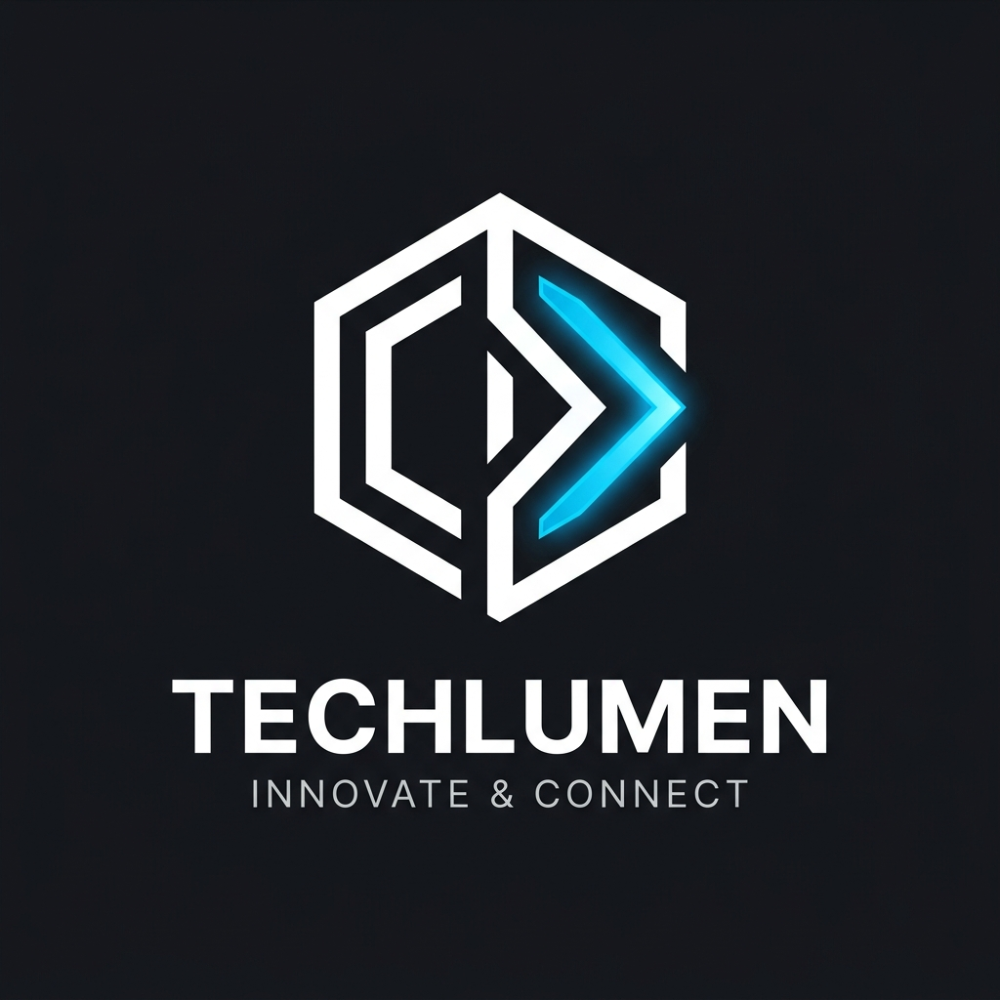

# TechStore - Premium React E-Commerce Project 🚀

TechStore is a modern, fully functional frontend E-Commerce web application built using **React** and **Vite**. It features a premium, sleek UI with a dark/light mode toggle, dynamic product filtering, a shopping cart, a wishlist system, and a comprehensive checkout flow.



## ✨ Features

- **🌗 Dark / Light Mode**: Seamless theme switching with persistent state using `localStorage`. Smooth CSS transitions applied across all components.
- **🛒 Shopping Cart**: Add products, adjust quantities, view total price, and remove items.
- **❤️ Wishlist**: Save favorite products in a dedicated panel. Move items directly from the wishlist to the cart.
- **🔍 Search & Filter**: Real-time search by product name or brand. Filter by categories and sort by Price, Rating, or Name.
- **💳 Checkout Flow**: A beautifully designed checkout modal featuring an order summary and 5 selectable payment methods (Cash on Delivery, UPI, Credit/Debit Card, Net Banking, EMI). Includes an animated order success confirmation.
- **🎨 Premium UI/UX**: Built with custom Vanilla CSS utilizing 60+ CSS variables for the theme. Includes hover effects, glassmorphism elements, SVG icons, and responsive design for mobile, tablet, and desktop.
- **⚡ Fast & Optimized**: Powered by Vite for lightning-fast HMR and optimized builds.

## 🛠️ Tech Stack

- **Framework**: React (using Functional Components & Hooks)
- **Build Tool**: Vite
- **Styling**: Pure CSS3 (CSS Variables, Flexbox, CSS Grid)
- **Icons**: Inline SVGs (No external font libraries)

## 🚀 Getting Started

### Prerequisites
Make sure you have [Node.js](https://nodejs.org/) installed on your machine.

### Installation

1. **Clone the repository:**
   ```bash
   git clone https://github.com/FakkirappaSS/TechStrore-Project-Using-React.git
   cd TechStrore-Project-Using-React
   ```

2. **Install dependencies:**
   ```bash
   npm install
   ```

3. **Run the development server:**
   ```bash
   npm run dev
   ```

4. **Open in browser:**
   Open [http://localhost:5173/](http://localhost:5173/) to view it in the browser.

## 📂 Project Structure

- `src/App.jsx`: Main application component, handles all global states (cart, wishlist, theme).
- `src/App.css`: Core styles and theme variables.
- `src/components/ProductCard.jsx`: Reusable card component for individual products.
- `src/components/ProductCard.css`: Styles specific to the product card.
- `src/data.js`: Mock database containing product information and image URLs.
- `index.html`: Entry point of the application.

## 🤝 Contributing
Contributions, issues, and feature requests are welcome! Feel free to check the [issues page](https://github.com/FakkirappaSS/TechStrore-Project-Using-React/issues).

## 📝 License
This project is open-source and available under the [MIT License](LICENSE).
